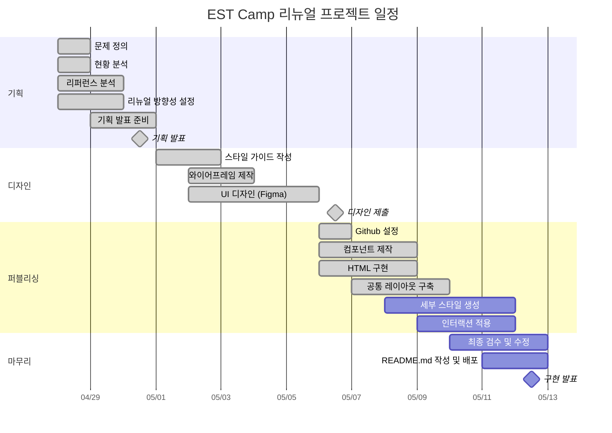

# No-Error : EST Camp (1차 프로젝트)

- 과정명: 프론트엔드 13기 개발자 양성(Figma)
- 기간: 2026/04/07 ~ 2026/08/21
- 1차 프로젝트: 2026/04/28 ~ 2026/05/12

## 🔗 빠른 링크

- 📑 기획서(피그마 슬라이드): https://www.figma.com/slides/Sf6CCul98z8CGkzd1neFEe
- 🎨 디자인 원본(피그마): https://www.figma.com/design/KVPJecLKdXEJV9q08kKKob/4%EC%A1%B0-%EC%9E%90%EB%A3%8C%EC%9A%A9-%EB%94%94%EC%9E%90%EC%9D%B8-%ED%8C%8C%EC%9D%BC?node-id=224-380&m=dev

## 1. 프로젝트 개요

### 1.1 목표

- **팀프로젝트 경험**: Git/GitHub 기반 협업 및 역할 분담 경험
- **디자인을 참조 코딩 실습**: 디자인 시안을 기반으로 한 웹 퍼블리싱 구현
- **실제 사이트 리뉴얼 경험**: 기존 교육 플랫폼의 UI/UX 및 정보 구조 개선
- **배포 경험**: GitHub Pages를 활용한 프로젝트 배포 및 운영 경험

### 1.2 👥 팀원

| 이름   | 역할           | 주요 담당                                          | GitHub                                                        | 연락                    |
| ------ | -------------- | -------------------------------------------------- | ------------------------------------------------------------- | ----------------------- |
| 배정호 | 팀장 · FE 리드 | Support Section<br>공통 클래스 작성<br>QA·코드리뷰    | [@raspbsb](https://github.com/raspbsb)                            | unionbjh@naver.com |
| 이민호 | FE · UI/디자인 | Header·Footer<br>CSS변수 작성                      | [@minho0391](https://github.com/minho0391)                         | minh05@naver.com       |
| 김해나 | FE · UI/디자인 | Trust Section<br>컴포넌트 작성                      | [@happynnah](https://github.com/happynnah)                        | happynnah@gmail.com       |
| 오예은 | FE · UI/디자인 | Program Section<br>컴포넌트 작성                    | [@dhdpdms0712-oss](https://github.com/dhdpdms0712-oss)            | dhdpdms0712@gmail.com       |
| 최예빈 | FE · UI/디자인 | Hero·Final CTA Section<br>컴포넌트 작성             | [@yebin-1129](https://github.com/yebin-1129)                      | cyb11299@gmail.com       |

### 1.3 🗓️ 마일스톤

#### 1일차 — 기획

- [ ] 프로젝트 주제 및 리뉴얼 방향성 정의
- [ ] 기존 사이트 현황 및 문제점 분석
- [ ] 레퍼런스 사이트 조사 및 벤치마킹

#### 2일차 — 기획

- [ ] 정보 구조 및 콘텐츠 구성 정리
- [ ] 메인 페이지 구성안 기획
- [ ] 발표용 기획 자료 제작
- [ ] 기획 발표 및 피드백 정리

#### 3일차 — 디자인

- [ ] 스타일 가이드 및 디자인 방향 설정
- [ ] 와이어프레임 제작
- [ ] 공통 UI 구조 설계
- [ ] 메인 페이지 디자인 작업

#### 4일차 — 디자인

- [ ] UI 디자인 마무리 및 수정
- [ ] 디자인 제출 및 피드백 반영
- [ ] GitHub 협업 환경 설정

#### 5일차 — 퍼블리싱

- [ ] 공통 레이아웃 및 기본 구조 작성
- [ ] 공통 컴포넌트 제작
- [ ] 메인 페이지 HTML 구조 구현
- [ ] 공통 CSS 및 변수 설계
- [ ] 카드/버튼/UI 스타일 작업

#### 6일차 — 퍼블리싱

- [ ] 세부 페이지 퍼블리싱
- [ ] 인터랙션 및 hover 효과 적용
- [ ] 반응형 레이아웃 대응
- [ ] 공통 스타일 리팩토링

#### 7일차 — 퍼블리싱

- [ ] 최종 UI 점검 및 수정
- [ ] README.md 작성
- [ ] GitHub Pages 배포
- [ ] 구현 발표 준비 및 최종 발표




---

## 2. 개발 환경 및 배포

### 2.1 개발 스택

#### Frontend

- **Styling**: CSS

#### Tools

- **Version Control**: Git & GitHub
- **Design**: Figma

### 2.2 배포 URL

- **Production**: https://raspbsb.github.io/EST_FE_13_1st_Project//

### 2.3 📚 개발 컨벤션 가이드

프로젝트에서 사용하는 HTML, CSS, JavaScript 작성 규칙은 아래 문서를 참고하세요.

- [HTML 컨벤션](docs/guide_html.md)
- [CSS 컨벤션](docs/guide_css.md)
- [JavaScript 컨벤션](docs/guide_js.md)

---

## 3. 프로젝트 구조

```
1st_Project/
├─ images/                    # 이미지/아이콘 통합
├─ fonts/                     # 웹폰트
├─ css/
│  ├─ common.css              # 전체 스타일 및 유틸리티 클래스
│  ├─ components.css          # 재사용 컴포넌트 스타일
│  ├─ index.css
│  ├─ normalize.css           # 베이스 스타일 : 브라우저 간 일관된 스타일링
│  ├─ reset.css               # 베이스 스타일 : 코드 기본값 초기화
│  ├─ variables.css           # Figma export 스타일
├─ common.html                # 재사용 HTML 구조
├─ index.html
└─ README.md
```

## 4. 향후 개선 사항

- 모바일 환경을 고려한 반응형 UI 최적화
- 사용자 접근성을 고려한 시맨틱 구조 개선
- 슬라이드/FAQ 영역 인터랙션 고도화
- 공통 컴포넌트 구조 리팩토링 및 유지보수성 개선
- 다크 모드 및 추가 테마 지원

## 5. 제작 후기

이번 프로젝트를 통해 기존 사이트를 분석하고,
정보 구조와 UI/UX를 개선하는 FE 과정을 직접 경험할 수 있었습니다.

기획, 디자인, 퍼블리싱 전 과정을 팀 단위로 진행하며
Git/GitHub 기반 협업 프로세스와 컴포넌트 중심 퍼블리싱 구조를 학습하였고,
실제 배포 과정까지 경험하며 웹 제작 흐름 전반에 대한 이해도를 높일 수 있었습니다.

## 6. 기획/디자인 문서

- **기획서(피그마 슬라이드)**: 사용자 흐름 설계, 리뉴얼 방향성, 스타일 가이드, 개발 기준 및 주요 구현 내용  
  링크: https://www.figma.com/slides/Sf6CCul98z8CGkzd1neFEe
- **디자인 원본(피그마)**: 컴포넌트, 컬러/타이포 스케일, 반응형 레이아웃, 아이콘
  링크: https://www.figma.com/design/KVPJecLKdXEJV9q08kKKob/4%EC%A1%B0-%EC%9E%90%EB%A3%8C%EC%9A%A9-%EB%94%94%EC%9E%90%EC%9D%B8-%ED%8C%8C%EC%9D%BC?node-id=224-380&m=dev

### 7. 미리보기

<!-- /public/readme/ 폴더에 썸네일 PNG를 넣고 경로를 맞춘다 -->

[](https://www.figma.com/slides/Sf6CCul98z8CGkzd1neFEe "피그마 슬라이드로 이동")
[](https://www.figma.com/design/KVPJecLKdXEJV9q08kKKob/4%EC%A1%B0-%EC%9E%90%EB%A3%8C%EC%9A%A9-%EB%94%94%EC%9E%90%EC%9D%B8-%ED%8C%8C%EC%9D%BC?node-id=224-380&m=dev "피그마 디자인으로 이동")

